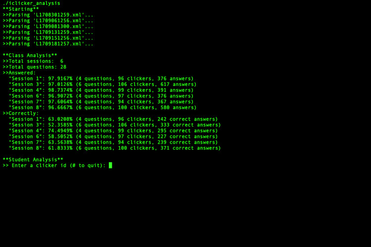
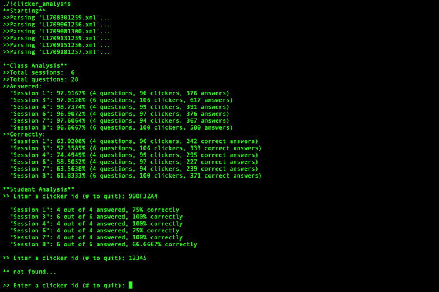
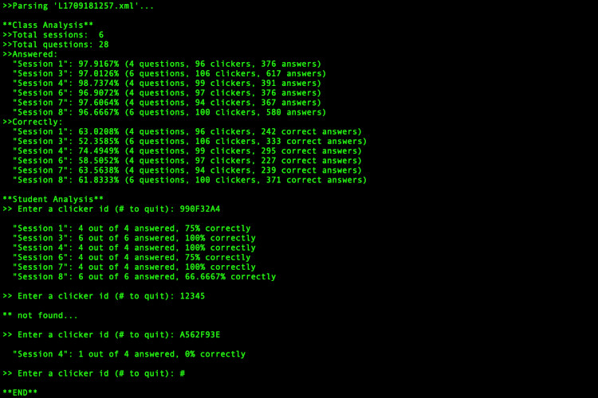

# iclicker-analysis
iClicker Analysis

This application uses as input iClicker data for miltiple class sessions from "files.txt", and then analyze this data to see how many questions were given, how many students answered, how many students answered correctly, and so on. The input files are text file in XML format. Then, application waits for user input. It analyze entered iClicker ID, and shows all available statistics for that specific iClicker ID.

